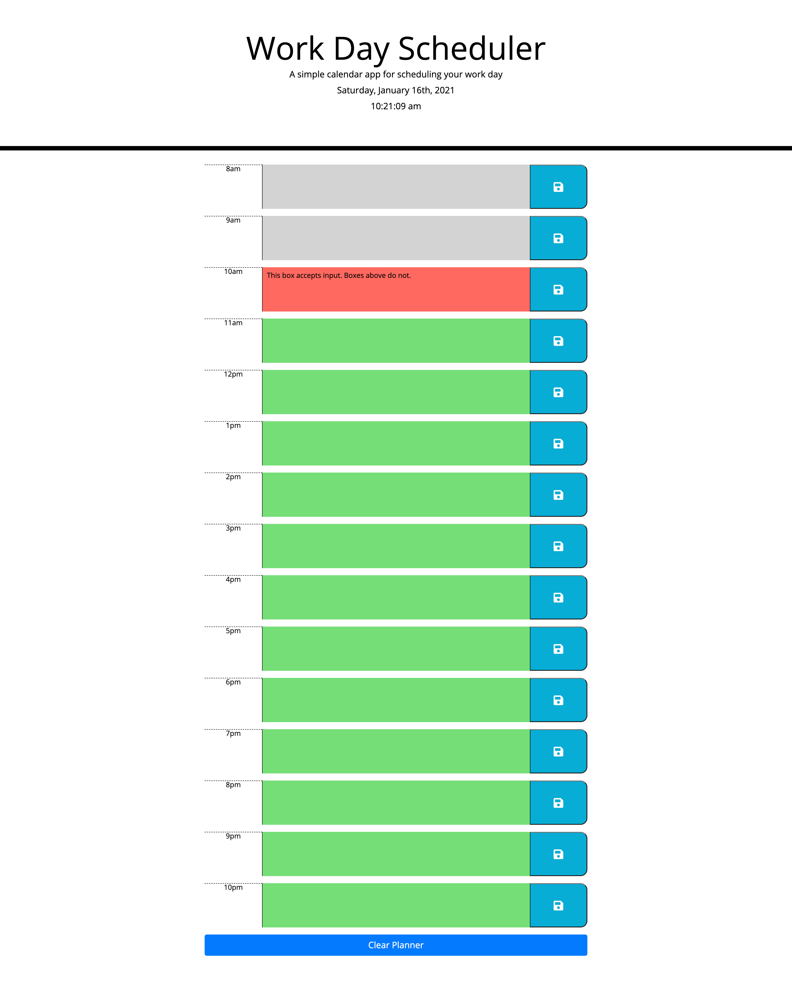
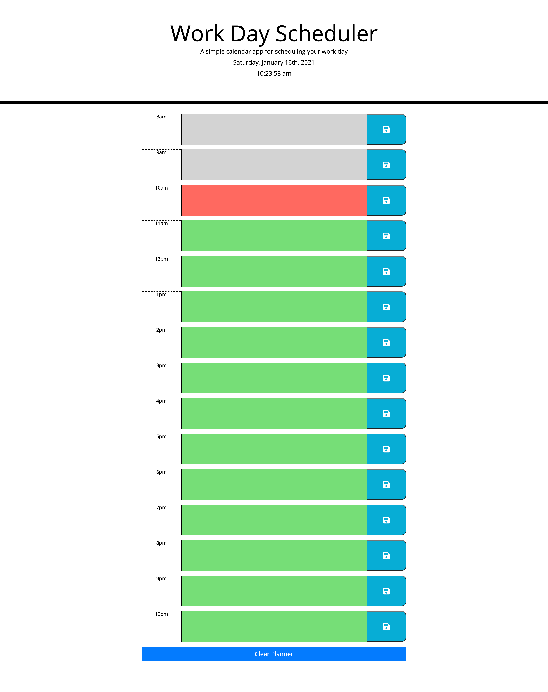
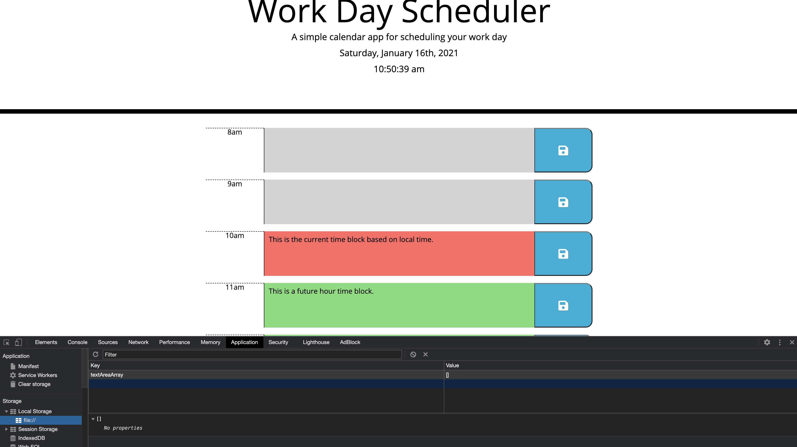
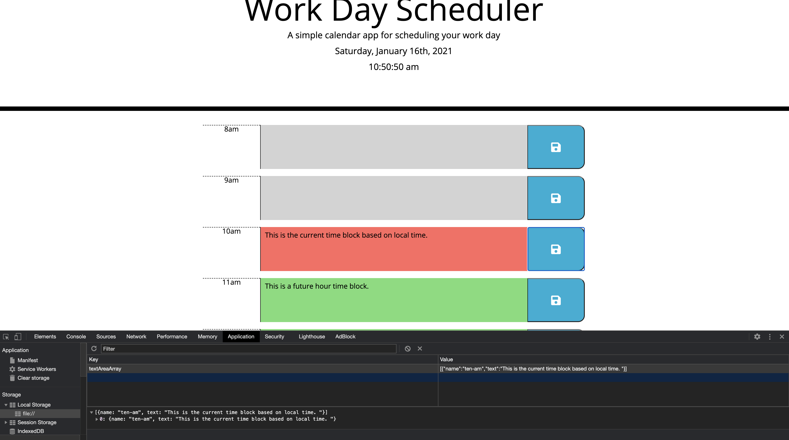
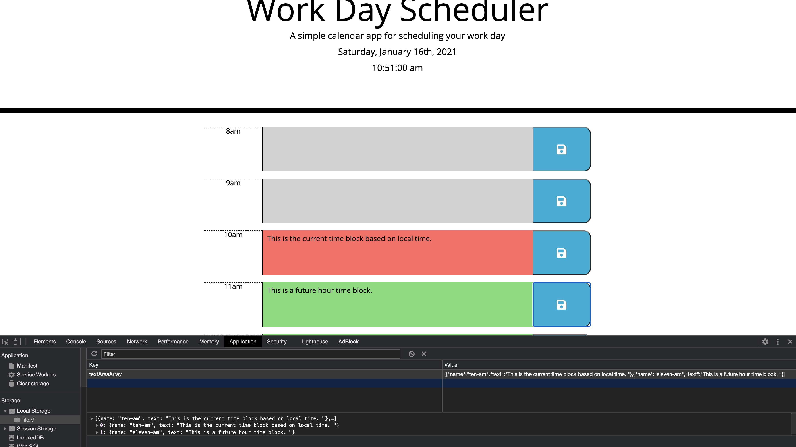
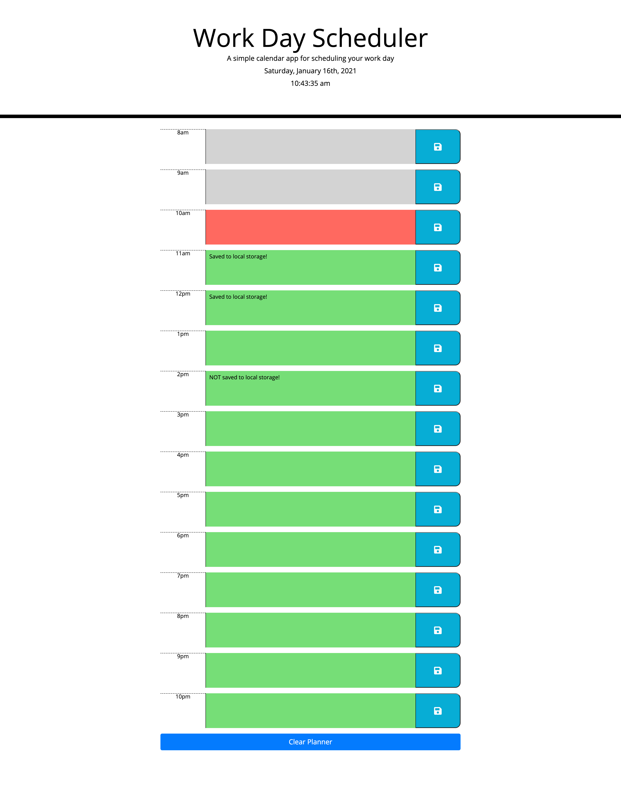
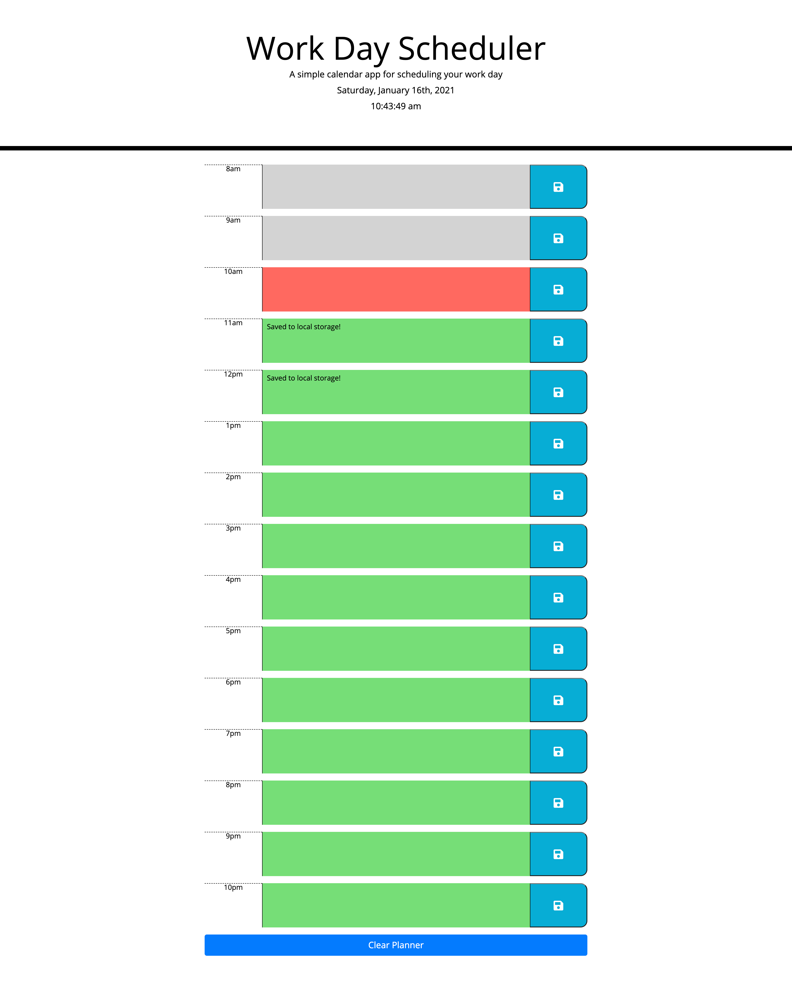

# Day-Planner

<strong>View project here:</strong> https://koltondecker.github.io/Day-Planner/

Organizing your day can help you get more accomplished by being able to visualize your to do list and set hourly goals. This project serves to provide that tool by giving the user the current date and time at the top of the page and then a series of time blocks for hours of the day that update in real time with color scheme to show past, present and future. Text can be inputted into time block text areas and then saved to local storage to be automatically loaded next time the page is loaded. The clear button at the bottom of the page also provides a quick and easy way to clear all text boxes on the page and the local storage to start fresh. 


## User Story

```
AS AN employee with a busy schedule
I WANT to add important events to a daily planner
SO THAT I can manage my time effectively
```


## Acceptance Criteria

```
GIVEN I am using a daily planner to create a schedule
WHEN I open the planner
- [x] THEN the current day is displayed at the top of the calendar
WHEN I scroll down
- [x] THEN I am presented with time blocks for standard business hours
WHEN I view the time blocks for that day
- [x] THEN each time block is color-coded to indicate whether it is in the past, present, or future
WHEN I click into a time block
- [x] THEN I can enter an event
WHEN I click the save button for that time block
- [x] THEN the text for that event is saved in local storage
WHEN I refresh the page
- [x] THEN the saved events persist
```


## Mock-Up

<h2><strong>Noteworthy Features:</strong></h2>

- Hour blocks that are in the past not only turn grey but also are given an attribute of 'disabled' to lock the text area from accepting input:
<br>
<br>

<br>
<br>

- Date at top of page automatically refreshes and rolls over to new day when the date changes in real time!
<br>
<br>

- Clear Button at bottom of page clears all text boxes and clears local storage to provide a clean planner to work from:
<br>
<br>

<br>
<br>
<hr>
<br>

<h2><strong>General Functionality:</strong></h2>

- Each time block has its own text box and save button that are linked to one another. Clicking a save button to the right of a text box saves that text box to a local storage array of objects:
<br>
<br>

<br>

<br>

<br>


- On page load, local storage is parsed and any saved time block text boxes are displayed in their appropriate spot using an array of objects in storage:
<br>
<br>

<br>

<br>
<hr>
<br>

<h2><strong>Future Feature Ideas:</strong></h2>

Toggle switches to provide options to:
- Hide time blocks in the past.
- Change color scheme.
- Change to horizontal view rather than vertical.
- Provide weekly view option.

<br>
<hr>
<br>

## Grading Requirements

This homework is graded based on the following criteria: 

### Technical Acceptance Criteria: 40%

- [x] * Satisfies all of the above acceptance criteria plus the following:

 - [x] * Uses the Moment.js library to work with date and time

### Deployment: 32%

- [x] * Application deployed at live URL

- [x] * Application loads with no errors

- [x] * Application GitHub URL submitted

- [x] * GitHub repo contains application code

### Application Quality: 15%

- [x] * Application user experience is intuitive and easy to navigate

- [x] * Application user interface style is clean and polished

- [x] * Application resembles the mock-up functionality provided in the homework instructions

### Repository Quality: 13%

- [x] * Repository has a unique name

- [x] * Repository follows best practices for file structure and naming conventions

- [x] * Repository follows best practices for class/id naming conventions, indentation, quality comments, etc.

- [x] * Repository contains multiple descriptive commit messages

- [x] * Repository contains quality README file with description, screenshot, and link to deployed application


## Review

You are required to submit BOTH of the following for review:

- [x] - * The URL of the functional, deployed application.

- [x] * The URL of the GitHub repository. Give the repository a unique name and include a README describing the project.

- - -
